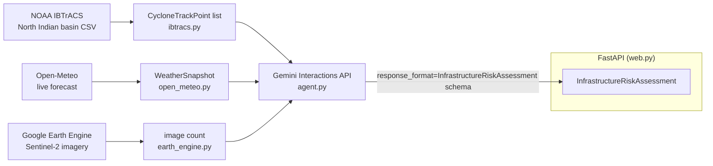

# CopperNick architecture

Status: describes the code as scaffolded, not a deployed or field-tested
system. This is not the hackathon's required architecture diagram deliverable
(a graphic) -- it's the working notes that diagram would be drawn from.

## Data flow

## What each real data source actually contributes

- **IBTrACS** gives a *historical* cyclone's real track, wind speed, and
  pressure readings for the North Indian Ocean basin (Bay of Bengal +
  Arabian Sea) -- including India's own RSMC New Delhi agency's readings
  where recorded (`NEWDELHI_*` columns, not currently consumed but present
  in the source data for a future iteration).
- **Open-Meteo** gives *live* precipitation and wind forecasts for the
  specific coordinates being assessed -- the "what if this track happened
  again, right now" signal.
- **Earth Engine** currently only returns a Sentinel-2 image *count* for the
  area/period -- a placeholder for an actual infrastructure-exposure layer
  (power grids, roads, shelters), not that layer itself.
- **Gemini** (Interactions API, structured output) is the only place actual
  judgment happens: it reads all three signals and produces the risk level,
  likely impacts, and draft advisory text. Everything else is deterministic
  data plumbing.

## What is not yet built

- **No physical storm-surge or rainfall-damage simulation.** The
  `confidence_caveats` field exists specifically so the agent states this
  limitation in its own output rather than the assessment implying more
  rigor than it has.
- **No real infrastructure inventory.** `fetch_recent_imagery_count` is a
  stand-in for an actual exposure map — it doesn't yet identify what
  power grids, roads, or shelters are in a storm's path.
- **No deployment.** `web.py` is not hosted anywhere yet — the hackathon's
  "deployed link" submission requirement is unmet.
- **No demo video or pitch deck** — non-code deliverables, not started.
- **Google Cloud credentials are not wired up from this codebase.** `.env`
  needs a real `GEMINI_API_KEY` and a Earth Engine project that has run
  `earthengine authenticate` once locally.
