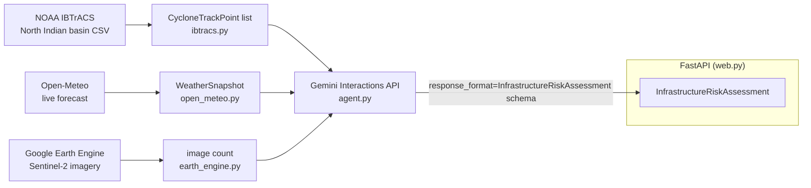
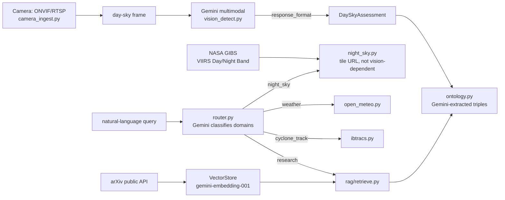

# CopperNick Vision architecture

Status: describes the code as scaffolded, not a deployed or field-tested
system. This is not the hackathon's required architecture diagram deliverable
(a graphic) -- it's the working notes that diagram would be drawn from.

## Data flow

## What each real data source actually contributes

- **IBTrACS** gives a *historical* cyclone's real track, wind speed, and
  pressure readings for the North Indian Ocean basin (Bay of Bengal +
  Arabian Sea) -- including India's own RSMC New Delhi agency's readings
  where recorded (`NEWDELHI_*` columns, not currently consumed but present
  in the source data for a future iteration).
- **Open-Meteo** gives *live* precipitation and wind forecasts for the
  specific coordinates being assessed -- the "what if this track happened
  again, right now" signal.
- **Earth Engine** currently only returns a Sentinel-2 image *count* for the
  area/period -- a placeholder for an actual infrastructure-exposure layer
  (power grids, roads, shelters), not that layer itself.
- **Gemini** (Interactions API, structured output) is the only place actual
  judgment happens: it reads all three signals and produces the risk level,
  likely impacts, and draft advisory text. Everything else is deterministic
  data plumbing.

## Sky Watch subsystem — passive early-warning only

Every piece of this subsystem is scoped to **detection and alerting for a
human reviewer, never tracking, targeting, or engagement**. That boundary is
enforced in the code, not just the docs: `DetectedSkyObject.anomaly` and
`DaySkyAssessment.alert_level` are informational flags with no automated
action attached anywhere in this codebase.

### Why a flat triple store, not a real ontology

`ontology.py` stores `(subject, relation, object, source)` triples, not a
formal RDF/OWL ontology with subsumption and inference rules. That's a
deliberate scope call: this build needs facts that persist and can be
filtered across sessions ("what have we observed about this coastline
before"), not formal ontological reasoning. A real reasoner is a
multi-week undertaking on its own; a triple store gets the useful 80% —
structured, source-attributed, queryable facts — at a fraction of the cost.
Revisit if a real reasoning requirement (not just storage/retrieval)
emerges.

### Why RTSP/ONVIF and not a vendor SDK

Any single camera vendor's SDK would break the "100% possible across specs
and brands" requirement by construction. ONVIF (discovery + stream
resolution) and RTSP (the universal streaming fallback) are the two open
standards essentially every IP camera implements — this is the correct
generalization, not a shortcut, but it also means there is no way to test
against real hardware without a physical camera, which this environment
doesn't have. See README Status for what remains hardware-unverified.

## What is not yet built

- **No physical storm-surge or rainfall-damage simulation.** The
  `confidence_caveats` field exists specifically so the agent states this
  limitation in its own output rather than the assessment implying more
  rigor than it has.
- **No real infrastructure inventory.** `fetch_recent_imagery_count` is a
  stand-in for an actual exposure map — it doesn't yet identify what
  power grids, roads, or shelters are in a storm's path.
- **No demo video or pitch deck** — non-code deliverables, not started.
- **Camera ingestion is hardware-unverified** — see the Sky Watch section
  above.
- **The Sky Watch endpoints are not on the live Cloud Run service** — only
  `/health` and `/assess` have been deployed; `/sky/*`, `/research/*`, and
  `/route` exist in the repo but not in production yet.
- **No live end-to-end Gemini test** — every Gemini-dependent code path
  (risk assessment, vision, embeddings, routing, ontology extraction) is
  verified against mocks and real API shapes, but not one real Gemini call
  has succeeded yet, because the account's AI Studio prepay-credit/identity-
  verification issue blocks every real call with a 429. See README Status.
